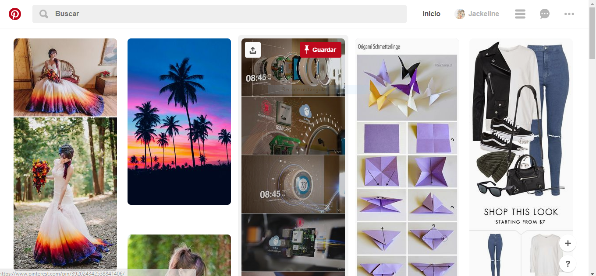

#### 1. Elige una web de tu preferencia y explica qué partes conforman el UX y qué partes el UI.

# Pinterest

# UX
* Mostrar atajos de guardar y compartir así como también la fuente de referencia al hacer hover sobre las imagenes.
* En el resultado de la búsqueda se muestra opciones relacionadas a esa búsqueda. 
* Atajos para subir una imagen.
* Puedes ocultar o denunciar una imagen. 
* Diseño de botones.
* Diseño de menús.
* La forma tamaño y colores de los cover 
* La barra de avances en el conu
* Al hacer clic sobre una imagen específica se muestra  una pequeña descripción
* Se muestra en el muro imagenes de búsqueda recientes. 
* Acceso rápido a la página principal con el icono de pinterest.
* En la vista imagen da la posibilidad de recorrer por más imágenes referenciales (con una fecha direccional).
* Muestra opciones de notificaciones.

# UI

* Muestra una imagen tipo modal.
* Diseño de los botones. 
* Barra de navegación. 
* Los colores de la marca (blanco y griss)
* Que pueda tener busqueda directa
* Mostrar las búsquedas recientes
* Colocar iconos anteriores y posteriores. 
* Barra de desplazmiento de un menu contextual.
* Dividió las  en columnas.
* Efectos en los iconos.
* Muestra hover.

